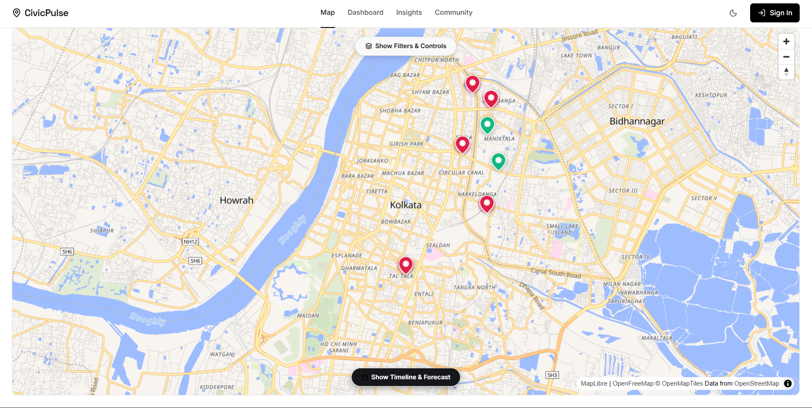
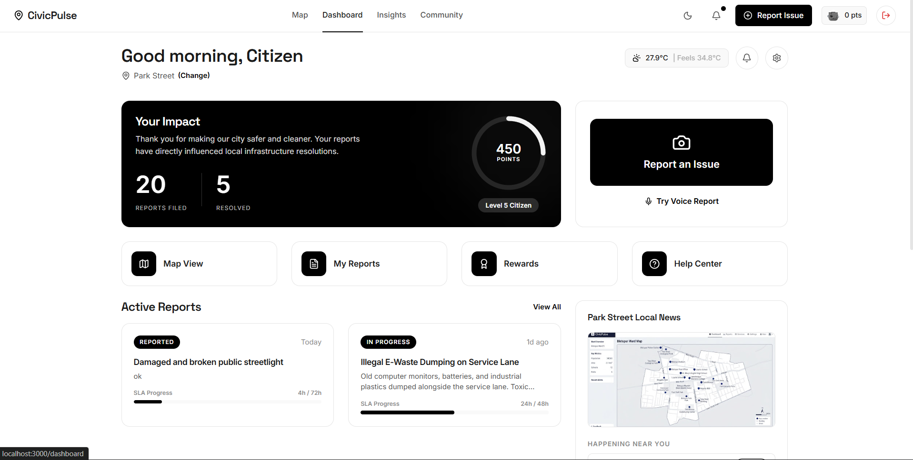

# 🏛️ CivicPulse
> Collaborative civic hazard logging ledger with real-time tracking, AI agent processing, and resolution verification.

CivicPulse is a comprehensive, full-stack civic platform that empowers citizens and ward inspectors to log public safety hazards (potholes, garbage piles, streetlight failures, broken pipes) and verify resolutions in real time. Backed by Express, React, and Google Gemini AI models, the application automates priority scoring, SLA predictions, voice cleaning, multilingual translation, and rigorous verification workflows.

---

## 📸 Visual Showcase

Explore the primary views of the CivicPulse interface:

| View | Screenshot | Description |
|------|------------|-------------|
| **Landing Portal** |  | Landing portal containing dynamic statistics, recent logs, and the warden leaderboard. |
| **Interactive Map** |  | Geographic ward ledger showing reported concerns mapped dynamically across city districts. |
| **Report Hazard** |  | Interactive filing form with live camera simulation, speech cleaning, and checkpoint options. |
| **Community Board** |  | Real-time public discussion forum for neighborhood wards, sortable by category and date. |
| **Citizen Dashboard** |  | Ward queue page displaying active resolutions, before/after visual verification, and municipal escalations. |

---

## 🚀 Key Features

### 📍 Geographic & Live Location Integration
*   **Ward Integration**: Mapped neighborhood ledger focused on key Kolkata wards (with a default Kolkata seed), supporting manual map plotting, auto-address resolution, and custom landmark aligners.
*   **Live Location Module**: Precision-5 geohashing and interactive locality pickers to accurately map hazards and dispatch repair crews.

### 🤖 AI Agent Orchestration
CivicPulse utilizes a sophisticated array of Gemini-powered agents for automated triage:
*   **Vision Triage (Predictive Agent)**: Scans submitted photos, determines category tags, grades severity (1-5), and computes target completion SLAs.
*   **Voice Cleanup (Summary Agent)**: Transforms raw speech transcript inputs into concise, structured titles and descriptions.
*   **Dual-Image Verification (Verification Agent)**: Side-by-side comparison of "before" and "after" photos to programmatically verify and close tickets.
*   **Duplicate Detection (Duplicate Agent)**: Detects nearby issues and merges duplicates using Gemini Vision.
*   **Weather Intelligence (Weather Agent)**: Fetches real-time weather data and posts geohash-specific flood alerts.

### 🛡️ Admin & Super-Admin Portals
*   **Role-Based Access Control (RBAC)**: Secure access routes configured for citizens, inspectors, admins, and super-admins.
*   **Comprehensive Dashboards**: 14+ management pages including Kanban boards, escalation details, worker assignments, system logs, API key management, and municipality oversight.

### 🌍 Multilingual Support
*   **Localized Context**: Built-in `LanguageContext` supporting live UI translations across English (`en`), Hindi (`hi`), and Bengali (`bn`) for inclusive citizen access.

### 🎮 Gamified Citizen Engagement
*   **Points Engine & Leaderboard**: Citizens earn points (+50 for reporting, +120 for verifying resolution) to unlock civic badges (e.g., Civic Champion, Community Guardian) and climb the municipal leaderboard.

---

## 🛠️ Technologies Used

| Layer | Technologies |
|-------|--------------|
| **Frontend** | React 18, Vite, Tailwind CSS, Framer Motion, Lucide Icons, MapLibre GL |
| **Backend** | Node.js, Express.js, TypeScript Executable (`tsx`) |
| **Database** | Firebase Firestore (Persistent NoSQL Data Store), Firebase Storage |
| **Authentication** | Firebase Auth (Anonymous Access, Email/Password Credentials) |
| **AI Models** | `@google/genai` (utilizing `gemini-2.5-flash` model templates) |
| **Testing & CI/CD**| Vitest, React Testing Library, GitHub Actions |

---

## 🏁 Quick Start

### 1. Installation
Install all backend and frontend dependencies:
```bash
npm install
```

### 2. Configuration
Create a `.env` file in the root directory:
```bash
cp .env.example .env
```
Fill out the variables as described in the [Configuration](#-configuration) section below.

### 3. Run Development Server
Launches the Express server and mounts the Vite frontend middleware on Port `3000`:
```bash
npm run dev
```

### 4. Build and Launch Production Server
```bash
npm run build
npm start
```

### 5. Testing
The project uses `vitest` and `@testing-library/react` for unit and integration testing.
```bash
# Run tests
npm test

# Run typechecking
npm run typecheck
```
A GitHub Actions CI workflow is configured to run tests and typechecking automatically on pushes and pull requests to `main`.

---

## ⚙️ Configuration

The following environment variables configure the application:

| Variable | Description | Required | Default / Note |
|----------|-------------|----------|----------------|
| `GEMINI_API_KEY` | Server Gemini AI Studio Key | Yes | Required for AI vision, voice cleanup, and agent orchestration. |
| `VITE_FIREBASE_API_KEY` | Firebase Web Client API Key | Yes | Required for database & auth connection. |
| `VITE_FIREBASE_AUTH_DOMAIN` | Firebase Web Auth Domain | Yes | Configures Firebase authorization domain. |
| `VITE_FIREBASE_PROJECT_ID` | Firebase Project ID | Yes | Identifies target Firebase DB/Storage. |
| `VITE_FIREBASE_STORAGE_BUCKET` | Firebase Storage Bucket | Yes | Bucket name for storing reports and images. |
| `VITE_FIREBASE_MESSAGING_SENDER_ID`| Firebase Messaging Sender ID | Yes | Used for push notifications. |
| `VITE_FIREBASE_APP_ID` | Firebase Web App ID | Yes | Client application ID. |
| `VITE_GOOGLE_MAPS_API_KEY` | Google Maps Platform API Key | No | Optional key to query Maps API for address names. |
| `DISABLE_ORCHESTRATOR` | Disables Local Background Agent orchestrator | No | Set to `true` locally to run without ADC credentials. |

---

## 🔒 Security Specifications & Data Invariance

CivicPulse is built with a zero-trust model to safeguard data integrity:
*   **Leaderboard Point Integrity**: Hardened Firebase Security Rules restrict write operations to `/users/{userId}` to the authenticated owner only, preventing point spoofing.
*   **Filing Validation**: Write rules for `/issues/{issueId}` require `request.auth.uid` to match the submitter's ID, and cap text inputs to prevent database overhead attacks.
*   **Protected Keys**: All AI calls (Gemini SDK) and geocoding operations run exclusively on the Express backend server, shielding sensitive credentials from browser bundles.
*   **RBAC Architecture**: Access control heavily regulated through typed roles (`src/types/roles.ts`) scaling from standard users up to system administrators.

---

## 📋 Directory Structure

```text
├── server.ts                  # Express server & API routes
├── firestore.rules            # Security rules for Firestore database
├── firebase-applet-config.json # Applet metadata configuration file
├── security_spec.md           # Zero-trust compliance rules and architecture guidelines
├── vitest.config.ts           # Vitest testing configuration
├── src/
│   ├── main.tsx               # App mount script
│   ├── App.tsx                # Main router & layout configuration
│   ├── pages/                 # Core page views (Map, Report, Dashboard, Insights, Admin)
│   ├── components/            # Shared UI components (Navbar, Error boundary, LocalitySelect)
│   ├── contexts/              # Authentication, User State, & Language contexts
│   ├── agents/                # Server-side Gemini AI Orchestration (Verification, Summary, etc.)
│   ├── i18n/                  # Multilingual translation dictionaries (en, hi, bn)
│   └── utils/                 # Points/reward scoring engine, geohashing, and Firebase seeders
```

---

## 📄 License

This project is licensed under the MIT License.
